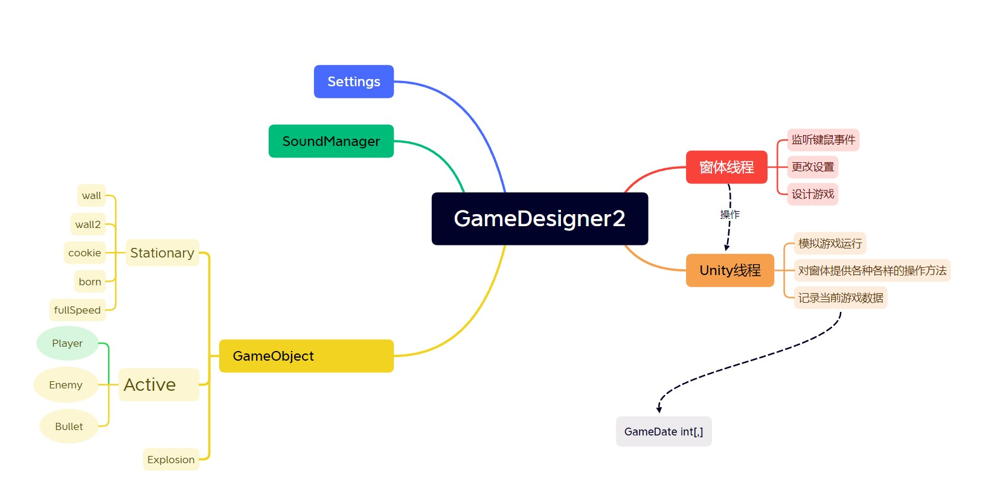

# 地址
[GitHub地址:https://github.com/AlbertGarcia0219/GameDesigner2](https://github.com/AlbertGarcia0219/GameDesigner2)
[Gitee地址:https://gitee.com/KiwiSenpaii/game-designer2](https://gitee.com/KiwiSenpaii/game-designer2)
# 目的
我是前端菜鸟，尝试学习后端的继承，线程等思想。
# 设计
一个线程负责设计，一个线程负责模拟运行。
1. 模仿Unity游戏引擎，游戏引擎有两个生命周期钩子，`Start()`和`Update()`，其中`Start()`只在窗口打开时执行执行一次，`Update()`的执行次数要看CPU的能力了。根据`Unity.testFPS()`的测试，在没有线程休眠的情况下，极限是每秒58帧。
2. 尽量将逻辑分开，窗体逻辑作为主线程，接收键鼠事件。`GameMainThread`是游戏的线程，负责模拟游戏的运行。
3. `Form1`只负责窗体的逻辑，不负责游戏的逻辑，例如打开弹出框，选择材料等。`Unity`是游戏的引擎，把所有与游戏相关的逻辑放在`Unity`中，例如创建敌人，摧毁墙等。这样在Coding的时候逻辑更清晰，扩展性更好，利于代码维护。

# 代码
## 继承
左侧是类，右侧是线程

游戏主要使用到的类
1. `GameObject`抽象类
> 坐标，宽高，图片，帧函数，碰撞算法，绘制自身
2. `Stationary`
> 实现父类抽象方法`GetImg`，设置宽高，并无子类，图中子类不过是换了图片和游戏数据。
3. `Active`
> 新增方向，速度，移动和碰撞检测函数
4. `Active`子类
> 重写父类帧函数，重写碰撞检测等等

## 游戏数据和List的关系
List存储了实际的游戏对象，用来遍历。
GameData是对游戏当前数据的映射，1是wall（墙），2是wall2（不可破坏的墙）等等，参考`Unity`的游戏设计模块。

**继承虽然可以很好地复用代码，但是同时会破坏封装。假设子类的某个函数使用到了父类的某个函数或者属性，一旦父类修改代码，子类几乎是必定要修改代码，破坏了封装反而会增加维护成本。最好的办法是用接口+组合**
## 碰撞检测
这次采用了比屏保泡泡更好的碰撞检测，用`Active`运动的下一帧的位置，也就是未来的位置来判断是否碰撞，省去了屏保泡泡碰撞之后将两个泡泡分开的步骤。
## 游戏数据
用二维数组做一个映射，并不根据二维数组渲染页面，用List存储实际的对象。
## MoveCheck
其实更应当作为一个抽象方法。
## 线程锁
因为多线程会出现两个线程同时操作同一资源的情况，需要上锁。
# 补充
1. 不能在遍历的一个`List`的同时去删除`List`中的元素。
# 缺陷
1. 游戏声音无法重合，无论 new 多少个`SoundPlayer`都只能同时播放一个音频。
> 尝试使用多线程播放多个音频，失败。
2. 后期逻辑不清晰。Unity引擎同时负责了模拟游戏和设计游戏，耦合性太强，没有用泛型，复用性差。